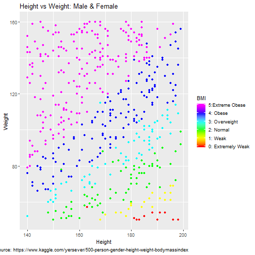

## Predict Health Status from Height and Weight

Objective:
 - Use the 500 Person Gender-Height-Weight-Body Mass Index (BMI) dataset from Kaggle
 - Predict a person's BMI given his/her Height and Weight measurements using a linear regression model
 - Provide visualization of dataset statistics

--- .class #id 

## Model Summary

- Multiple-R-squared (R2) value = 0.8259 which shows that the model is a good fit! 
- p-values show that the variables Height & Weight are very significant.


```
## 
## Call:
## lm(formula = Index ~ Height + Weight, data = BMIdata)
## 
## Residuals:
##      Min       1Q   Median       3Q      Max 
## -2.34074 -0.38219  0.06156  0.39778  1.11542 
## 
## Coefficients:
##               Estimate Std. Error t value Pr(>|t|)    
## (Intercept)  6.1211460  0.2771076   22.09   <2e-16 ***
## Height      -0.0349686  0.0015487  -22.58   <2e-16 ***
## Weight       0.0336751  0.0007832   43.00   <2e-16 ***
## ---
## Signif. codes:  0 '***' 0.001 '**' 0.01 '*' 0.05 '.' 0.1 ' ' 1
## 
## Residual standard error: 0.5665 on 497 degrees of freedom
## Multiple R-squared:  0.8259,	Adjusted R-squared:  0.8252 
## F-statistic:  1179 on 2 and 497 DF,  p-value: < 2.2e-16
```

---

## Dataset Visualization sample



---

## App Interface

<iframe src = 'https://kmmkhalid.shinyapps.io/ddp_shinyproject/' ></iframe>


